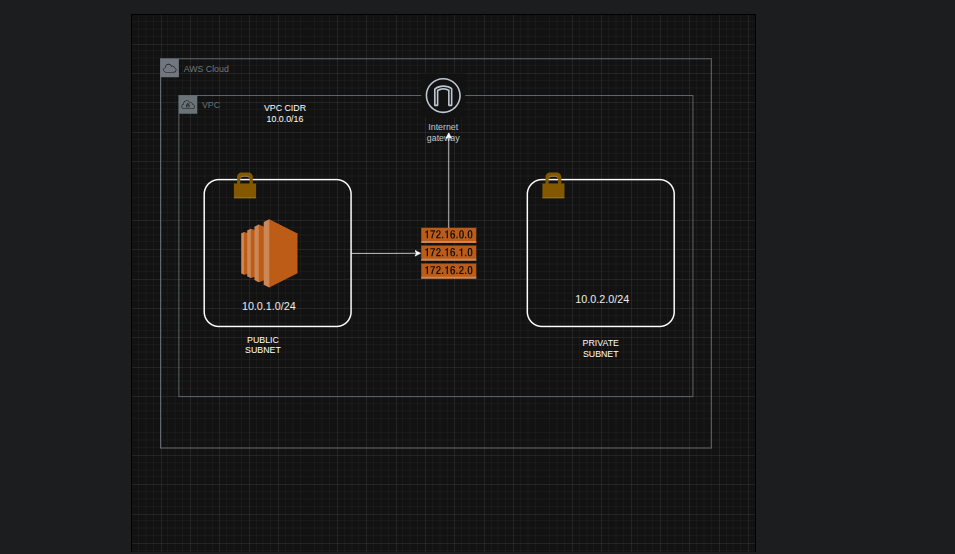
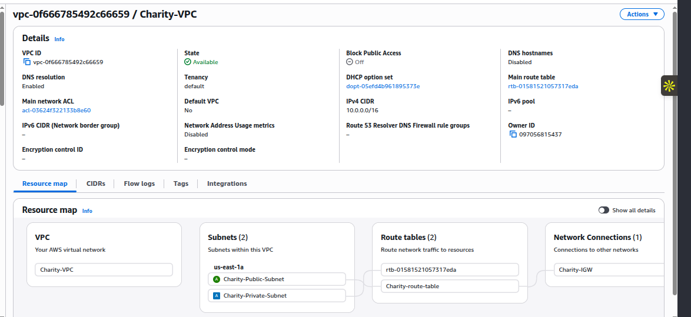
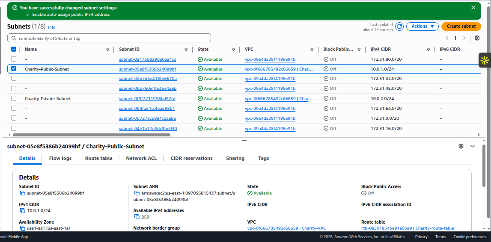
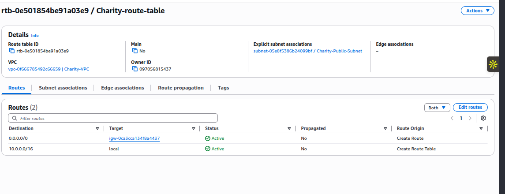
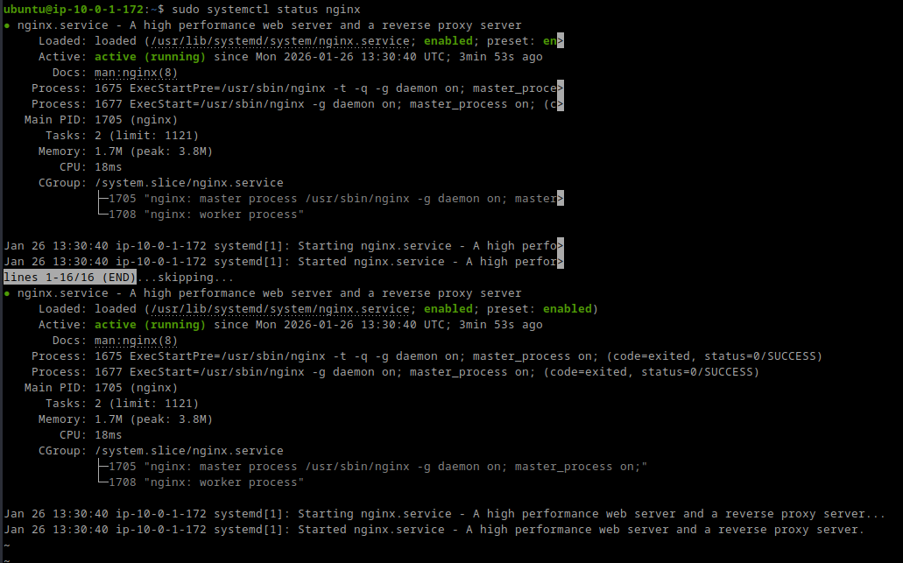

# Secure AWS VPC + Charity Website (DevOps Project)

## Summary
This project designs and deploys a secure **2-tier AWS VPC** and hosts a **public-facing charity website** on an **EC2 NGINX web server**. It is built in a DevOps style: **Infrastructure as Code (Terraform)** + **CI/CD (GitHub Actions)**.

---

## Architecture
**Network**
- VPC CIDR: `10.0.0.0/16`
- Public Subnet: `10.0.1.0/24`
- Private Subnet: `10.0.2.0/24`
- Internet Gateway
- Route Tables (public route: `0.0.0.0/0 -> IGW`)

**Compute**
- Ubuntu EC2 instance in the Public Subnet
- NGINX installed and configured to serve the site

**Security**
- HTTP (80) allowed from anywhere
- HTTPS (443) allowed from anywhere
- SSH (22) allowed only from a trusted IP
- Outbound traffic allowed (required for `apt` + GitHub pulls)

---

## What I Built (Portfolio Proof)
- Designed a secure VPC with segmented subnets (public/private)
- Configured routing and internet gateway access
- Implemented security controls using Security Groups
- Deployed a charity website from GitHub on NGINX
- Rebuilt the infrastructure using Terraform
- Automated checks + deployments using GitHub Actions (CI/CD)

---

## Live Site
Once provisioned, the website is available at:
- `http://<EC2_PUBLIC_IP>`

> Note: For cost control, the EC2 instance can be terminated and recreated at any time using Terraform.

---

## Troubleshooting Highlight (Real DevOps Debugging)
During deployment, package installs (`apt`) failed due to blocked outbound connectivity.
**Root cause:** the Security Group had **no outbound rules**, preventing internet access.
**Fix:** restored outbound egress (`0.0.0.0/0`). Deployment immediately succeeded.

---

# Terraform Deployment

## Prerequisites
- Terraform installed
- AWS credentials configured locally
- Existing EC2 Key Pair name (e.g. `Charitykeypair`)
- Your public IP in CIDR format for SSH (e.g. `197.x.x.x/32`)

## Deploy
```bash
cd terraform
terraform init
terraform apply -auto-approve \
  -var="key_name=Charitykeypair" \
  -var="ssh_cidr=YOUR_PUBLIC_IP/32"

---

## 📸 Deployment Screenshots

### Architecture Diagram


---

### VPC Overview


---

### Subnets Configuration


---

### Route Table Configuration


---

### Security Group – Inbound Rules


---

### Security Group – Outbound Rules


---

### EC2 Instance List


---

### EC2 Instance Summary


---

### NGINX Running


---

### Website Live

